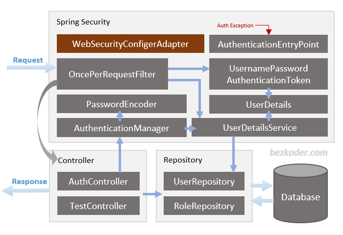
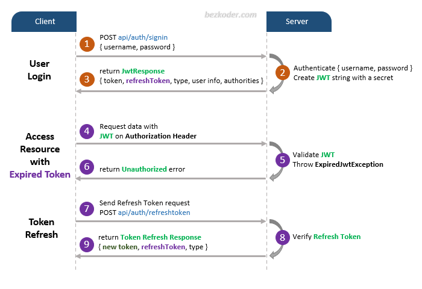

# Spring Boot JWT Authentication example with Spring Security & Spring Data JPA

## User Registration, User Login and Authorization process.
The diagram shows flow of how we implement User Registration, User Login and Authorization process.


## Spring Boot Server Architecture with Spring Security
You can have an overview of our Spring Boot Server with the diagram below:



## Dependency
– If you want to use PostgreSQL:
```xml
<dependency>
  <groupId>org.postgresql</groupId>
  <artifactId>postgresql</artifactId>
  <scope>runtime</scope>
</dependency>
```
– or MySQL:
```xml
<dependency>
  <groupId>com.mysql</groupId>
  <artifactId>mysql-connector-j</artifactId>
  <scope>runtime</scope>
</dependency>
```
## Configure Spring Datasource, JPA, App properties
Open `src/main/resources/application.properties`
- For PostgreSQL:
```
spring.datasource.url= jdbc:postgresql://localhost:5432/testdb
spring.datasource.username= postgres
spring.datasource.password= 123

spring.jpa.properties.hibernate.jdbc.lob.non_contextual_creation= true
spring.jpa.properties.hibernate.dialect= org.hibernate.dialect.PostgreSQLDialect

# Hibernate ddl auto (create, create-drop, validate, update)
spring.jpa.hibernate.ddl-auto= update

# App Properties
bezkoder.app.jwtSecret= bezKoderSecretKey
bezkoder.app.jwtExpirationMs= 86400000
```
- For MySQL
```
spring.datasource.url=jdbc:mysql://localhost:3306/testdb_spring?useSSL=false
spring.datasource.username=root
spring.datasource.password=123456

spring.jpa.properties.hibernate.dialect=org.hibernate.dialect.MySQLDialect
spring.jpa.hibernate.ddl-auto=update

# App Properties
bezkoder.app.jwtSecret= ======================BezKoder=Spring===========================
bezkoder.app.jwtExpirationMs=86400000
```
## Run Spring Boot application
```
mvn spring-boot:run
```

## Run following SQL insert statements
```
INSERT INTO roles(name) VALUES('ROLE_USER');
INSERT INTO roles(name) VALUES('ROLE_MODERATOR');
INSERT INTO roles(name) VALUES('ROLE_ADMIN');
```

For more detail, please visit:
> [Secure Spring Boot with Spring Security & JWT Authentication](https://bezkoder.com/spring-boot-jwt-authentication/)

> [For MongoDB](https://bezkoder.com/spring-boot-jwt-auth-mongodb/)

## Refresh Token



For instruction: [Spring Boot Refresh Token with JWT example](https://bezkoder.com/spring-boot-refresh-token-jwt/)

## More Practice:
> [Spring Boot JWT Authentication example using HttpOnly Cookie](https://www.bezkoder.com/spring-boot-login-example-mysql/)

> [Spring Boot File upload example with Multipart File](https://bezkoder.com/spring-boot-file-upload/)

> [Exception handling: @RestControllerAdvice example in Spring Boot](https://bezkoder.com/spring-boot-restcontrolleradvice/)

> [Spring Boot Repository Unit Test with @DataJpaTest](https://bezkoder.com/spring-boot-unit-test-jpa-repo-datajpatest/)

> [Spring Boot Pagination & Sorting example](https://www.bezkoder.com/spring-boot-pagination-sorting-example/)

> Validation: [Spring Boot Validate Request Body](https://www.bezkoder.com/spring-boot-validate-request-body/)

> Documentation: [Spring Boot and Swagger 3 example](https://www.bezkoder.com/spring-boot-swagger-3/)

> Caching: [Spring Boot Redis Cache example](https://www.bezkoder.com/spring-boot-redis-cache-example/)

Associations:
> [Spring Boot One To Many example with Spring JPA, Hibernate](https://www.bezkoder.com/jpa-one-to-many/)

> [Spring Boot Many To Many example with Spring JPA, Hibernate](https://www.bezkoder.com/jpa-many-to-many/)

> [JPA One To One example with Spring Boot](https://www.bezkoder.com/jpa-one-to-one/)

Deployment:
> [Deploy Spring Boot App on AWS – Elastic Beanstalk](https://www.bezkoder.com/deploy-spring-boot-aws-eb/)

> [Docker Compose Spring Boot and MySQL example](https://www.bezkoder.com/docker-compose-spring-boot-mysql/)

## Fullstack Authentication

> [Spring Boot + Vue.js JWT Authentication](https://bezkoder.com/spring-boot-vue-js-authentication-jwt-spring-security/)

> [Spring Boot + Angular 8 JWT Authentication](https://bezkoder.com/angular-spring-boot-jwt-auth/)

> [Spring Boot + Angular 10 JWT Authentication](https://bezkoder.com/angular-10-spring-boot-jwt-auth/)

> [Spring Boot + Angular 11 JWT Authentication](https://bezkoder.com/angular-11-spring-boot-jwt-auth/)

> [Spring Boot + Angular 12 JWT Authentication](https://www.bezkoder.com/angular-12-spring-boot-jwt-auth/)

> [Spring Boot + Angular 13 JWT Authentication](https://www.bezkoder.com/angular-13-spring-boot-jwt-auth/)

> [Spring Boot + Angular 14 JWT Authentication](https://www.bezkoder.com/angular-14-spring-boot-jwt-auth/)

> [Spring Boot + Angular 15 JWT Authentication](https://www.bezkoder.com/angular-15-spring-boot-jwt-auth/)

> [Spring Boot + Angular 16 JWT Authentication](https://www.bezkoder.com/angular-16-spring-boot-jwt-auth/)

> [Spring Boot + React JWT Authentication](https://bezkoder.com/spring-boot-react-jwt-auth/)

## Fullstack CRUD App

> [Vue.js + Spring Boot + H2 Embedded database example](https://www.bezkoder.com/spring-boot-vue-js-crud-example/)

> [Vue.js + Spring Boot + MySQL example](https://www.bezkoder.com/spring-boot-vue-js-mysql/)

> [Vue.js + Spring Boot + PostgreSQL example](https://www.bezkoder.com/spring-boot-vue-js-postgresql/)

> [Angular 8 + Spring Boot + Embedded database example](https://www.bezkoder.com/angular-spring-boot-crud/)

> [Angular 8 + Spring Boot + MySQL example](https://bezkoder.com/angular-spring-boot-crud/)

> [Angular 8 + Spring Boot + PostgreSQL example](https://bezkoder.com/angular-spring-boot-postgresql/)

> [Angular 10 + Spring Boot + MySQL example](https://bezkoder.com/angular-10-spring-boot-crud/)

> [Angular 10 + Spring Boot + PostgreSQL example](https://bezkoder.com/angular-10-spring-boot-postgresql/)

> [Angular 11 + Spring Boot + MySQL example](https://bezkoder.com/angular-11-spring-boot-crud/)

> [Angular 11 + Spring Boot + PostgreSQL example](https://bezkoder.com/angular-11-spring-boot-postgresql/)

> [Angular 12 + Spring Boot + Embedded database example](https://www.bezkoder.com/angular-12-spring-boot-crud/)

> [Angular 12 + Spring Boot + MySQL example](https://www.bezkoder.com/angular-12-spring-boot-mysql/)

> [Angular 12 + Spring Boot + PostgreSQL example](https://www.bezkoder.com/angular-12-spring-boot-postgresql/)

> [Angular 13 + Spring Boot + H2 Embedded Database example](https://www.bezkoder.com/spring-boot-angular-13-crud/)

> [Angular 13 + Spring Boot + MySQL example](https://www.bezkoder.com/spring-boot-angular-13-mysql/)

> [Angular 13 + Spring Boot + PostgreSQL example](https://www.bezkoder.com/spring-boot-angular-13-postgresql/)

> [Angular 14 + Spring Boot + H2 Embedded Database example](https://www.bezkoder.com/spring-boot-angular-14-crud/)

> [Angular 14 + Spring Boot + MySQL example](https://www.bezkoder.com/spring-boot-angular-14-mysql/)

> [Angular 14 + Spring Boot + PostgreSQL example](https://www.bezkoder.com/spring-boot-angular-14-postgresql/)

> [Angular 15 + Spring Boot + H2 Embedded Database example](https://www.bezkoder.com/spring-boot-angular-15-crud/)

> [Angular 15 + Spring Boot + MySQL example](https://www.bezkoder.com/spring-boot-angular-15-mysql/)

> [Angular 15 + Spring Boot + PostgreSQL example](https://www.bezkoder.com/spring-boot-angular-15-postgresql/)

> [Angular 16 + Spring Boot + H2 Embedded Database example](https://www.bezkoder.com/spring-boot-angular-16-crud/)

> [Angular 16 + Spring Boot + MySQL example](https://www.bezkoder.com/spring-boot-angular-16-mysql/)

> [Angular 16 + Spring Boot + PostgreSQL example](https://www.bezkoder.com/spring-boot-angular-16-postgresql/)

> [React + Spring Boot + MySQL example](https://bezkoder.com/react-spring-boot-crud/)

> [React + Spring Boot + PostgreSQL example](https://bezkoder.com/spring-boot-react-postgresql/)

> [React + Spring Boot + MongoDB example](https://bezkoder.com/react-spring-boot-mongodb/)

Run both Back-end & Front-end in one place:
> [Integrate Angular with Spring Boot Rest API](https://bezkoder.com/integrate-angular-spring-boot/)

> [Integrate React.js with Spring Boot Rest API](https://bezkoder.com/integrate-reactjs-spring-boot/)

> [Integrate Vue.js with Spring Boot Rest API](https://bezkoder.com/integrate-vue-spring-boot/)
